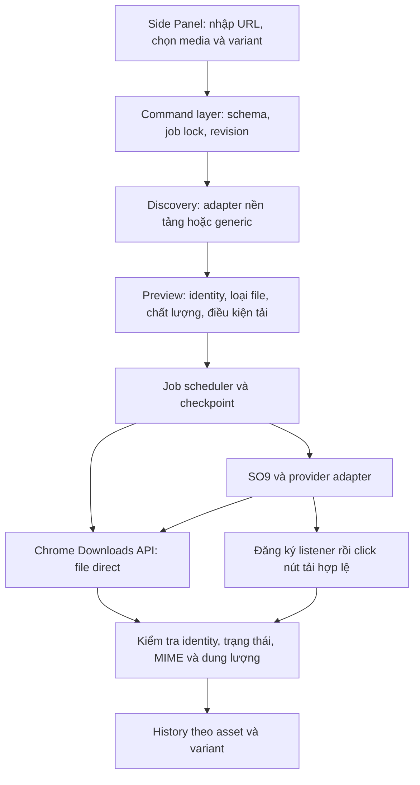

# Rà soát hiện trạng và kế hoạch nâng cấp Mike-Autodownload

Ngày kiểm tra: **04/10/2026, Asia/Saigon**. Phạm vi ưu tiên theo yêu cầu: cả nền tảng hiện có, YouTube/Suno/trang AI tạo media, và media trực tiếp trên website được cấp quyền.

**Kết luận:** bản local có nhiều tính năng hơn GitHub, nhưng chưa đủ điều kiện phát hành: service worker có lỗi cú pháp và các phép mô phỏng tái hiện được lỗi nhận nhầm download, xác thực file, hàng đợi, phục hồi và khóa job. Nên sửa nền tảng trước, sau đó mở rộng bằng adapter và mô hình nhiều tài nguyên. Mục tiêu khả thi là tải nhiều loại media mà trang cung cấp và người dùng được phép tải; không thể cam kết mọi media trên mọi nền tảng.

Đây là **bản ghi baseline và kế hoạch lịch sử**. Sau lượt rà soát, runtime đã được triển khai theo các gate G0–G3 một phần trong worktree hiện tại; bằng chứng mới nhất nằm ở `npm run check`, `tools/audit-current-runtime.mjs`, `tools/e2e-extension.mjs` và [báo cáo benchmark](BENCHMARK_2026-10-04.md). Các đoạn mô tả “chưa sửa runtime” bên dưới giữ nguyên để bảo toàn lịch sử baseline, không phải trạng thái hiện tại.

### Trạng thái triển khai hiện tại

Đã có: policy xác thực video/audio/image/subtitle; scanner DOM/structured-data có ràng buộc identity; merge queue/history canonical; giới hạn URL và dung lượng queue; checkpoint crawl; phục hồi job/tab; correlation download nghiêm ngặt; UI quét rồi chọn media; retry từng mục; kiểm thử 81/81; E2E Chromium cô lập 11/11; audit runtime 9/9. Chưa có: smoke download trực tiếp trên từng website thật, adapter đầy đủ cho mọi nền tảng, HLS/DASH hoặc DRM/paywall bypass, và native companion. Vì vậy đây là bản nâng cấp candidate đã kiểm chứng cục bộ, chưa phải lời hứa “mọi media trên mọi website”.

## 1. Bản nào đang được kiểm tra?

| Nguồn | Trạng thái xác minh | Nhận xét |
|---|---|---|
| Worktree của chat | `C:\Users\Mr Trung\.codex\worktrees\3a18\autodownload`, HEAD `f7819c34718c06a9d558a7411bb1f5d65250960c`, v2.0.0, detached HEAD | Sạch trước rà soát; đây là mã nguồn dùng để kiểm chứng |
| Checkout chính trên máy | `E:\Projects\EXTENSIONS\autodownload`, nhánh `main`, cùng HEAD `f7819c3` | Không có thay đổi tracked hoặc file untracked trước rà soát; cùng bản với worktree |
| Đường dẫn cũ trong AGENTS.md | `D:\autodowload` | Không tồn tại trên máy tại thời điểm kiểm tra |
| [GitHub của dự án](https://github.com/mikeTran99/Mike-AutoDownload/tree/0d7598321a9a77eec7098099509a0925eb078f1e) | `main` = `0d7598321a9a77eec7098099509a0925eb078f1e`, manifest v1.2.1, commit ngày 07/07/2026 | Xác minh bằng `git ls-remote` và `git fetch origin main`, không chỉ dựa vào trang web được cache |

GitHub là tổ tiên của local: **remote-only 0 commit, local-only 12 commit**. Diff Git ghi nhận **50 file thay đổi, 7.223 dòng thêm, 2.828 dòng xóa**; có ảnh hưởng của việc chuyển runtime từ root sang `src/`, nên đây không phải số dòng tính năng mới thuần túy.

| Hạng mục | GitHub v1.2.1 | Local v2.0.0 |
|---|---|---|
| Tên trong manifest | Tên cũ | `Mike-Autodownload` đúng quy tắc hiện tại |
| Runtime | File ở root | `src/background`, `content`, `popup`, `options`, `shared` |
| Nguồn tải | SO9 và các luồng direct/Telegram cơ bản | Chuỗi nguồn theo nền tảng, thêm YouTube/Bilibili; chưa được xác minh sống bằng lượt tải thực tế trong audit này |
| Quét kênh | Facebook/TikTok | Thêm Instagram/Douyin/YouTube, dashboard thống kê |
| Độ bền job tải | Trạng thái đơn giản | Có `jobState`, alarms, resume, retry; vẫn còn lỗi ở các nhánh cụ thể |
| Giao diện | Side Panel cơ bản | VI/EN, lịch sử chống trùng một phần, tiến độ, CSV, phân trang queue |
| Kiểm tra/phát hành | Chưa có bộ test/CI như local | 27 test, workflow checks/release, LICENSE, PRIVACY |

Giữ local làm baseline phát triển. Không lấy GitHub cũ ghi đè lên bản này. Chỉ đồng bộ 12 commit sau khi sửa các lỗi chặn phát hành và hoàn tất kiểm tra; không đánh dấu CI xanh là đã tải media thành công.

## 2. Đã kiểm tra đến đâu?

- Đọc manifest, worker, content script, Side Panel, options, shared modules, toàn bộ bộ test, workflows, README, PRIVACY và kế hoạch cũ.
- Kiểm tra các đường chạy: nhập link → route → quyền → job → native/SO9/fallback → download → success/history → restart/stop.
- Rà luồng quét kênh, ghi queue, chống trùng, thống kê và giới hạn storage.
- Clone **chỉ để đọc** hai repo tham khảo vào thư mục tạm; không chạy phần mềm hay cài release của họ.
- Chạy `npm.cmd run check`: **27/27 pass**, syntax mặc định báo thành công, có cảnh báo Node về package chưa khai báo module type.
- Kiểm tra cả sáu file JS theo chế độ module/classic rõ ràng: **5 file pass, worker fail**. Lỗi cũng có trong nội dung commit HEAD, không chỉ trong working tree.
- Chạy **9 phép kiểm chứng hành vi**, tất cả tái hiện được vấn đề/giới hạn được mô tả dưới đây. Không có lỗi nội bộ của harness.

**Giới hạn bằng chứng:** chưa chạy tải TikTok end-to-end, chưa xác minh các site dự phòng bằng lượt tải thật, chưa kiểm chứng Suno hay trang AI bằng tài khoản của người dùng. Worker hiện tại không parse được nên không thể coi bản source này là bản đã chạy đạt trên Chrome. Bộ probe dùng mock Chrome API và DOM giả lập, không thay thế kiểm tra trình duyệt. Một bản extension đã nạp từ thư mục/commit khác có thể vẫn chạy; audit này không xác định phiên bản đang được nạp trong Chrome.

### Lỗi bộ kiểm tra hiện tại

Ba dòng `src/background/service-worker.js:582`, `:675`, `:943` dùng token `\"info\"` ngoài chuỗi, thay vì `"info"`. Parser module báo `SyntaxError: Invalid or unexpected token`. `git blame` quy về commit `9653442` ngày 11/09/2026.

Trên **Node v24.16.0 của máy này**, `node --check src/background/service-worker.js` trả exit 0, nhưng kiểm tra STDIN với `--input-type=module --check` trả exit 1. Đây là kết quả quan sát của môi trường này; không suy rộng rằng mọi phiên bản Node đều có cùng hành vi. Test syntax hiện gọi cùng kiểu lệnh mặc định, còn nhiều contract test chỉ tìm chuỗi trong file nên không bắt được lỗi. [Node CLI mô tả chế độ input module và cơ chế phát hiện cú pháp](https://nodejs.org/api/cli.html#--input-typetype).

Công cụ tái hiện:

```powershell
node tools/audit-current-runtime.mjs
node tools/audit-current-runtime.mjs --allow-baseline-syntax-repair
```

Lệnh đầu kiểm tra source nguyên trạng và dừng probe logic nếu có syntax lỗi. Lệnh sau chỉ sửa **ba token đã nêu trong bản sao RAM**, để chạy tiếp các probe. Công cụ không sửa file source, không kết nối mạng, không mở Chrome và không tải file thật. Exit 1 nghĩa là còn phát hiện hoặc probe lỗi. Khi đọc kết quả logic, phải giữ nguyên điều kiện: chúng được thực thi trên bản sao đã sửa lỗi cú pháp tối thiểu.

## 3. Bảng phát hiện và hướng sửa

Mức ưu tiên: **P0** chặn nạp/phát hành; **P1** có thể sai file, mất queue hoặc sai job; **P2** giới hạn chức năng, độ bền, hiệu năng và dữ liệu; **P3** tài liệu/duy trì. “Mô phỏng” là tái hiện bằng code hiện tại cùng mock; “đọc code” là phát hiện tĩnh, chưa chạy tình huống thật trên Chrome.

| ID | Mức | Phát hiện và bằng chứng | Tác động | Hướng sửa / nghiệm thu |
|---|---|---|---|---|
| A01 | P0 | Worker sai cú pháp tại 582/675/943; kiểm tra module fail trong file và commit HEAD, trong khi `npm run check` pass | MV3 worker không thể đăng ký từ source này; lệnh Start/crawl không hoạt động | Sửa ba token; checker đọc toàn bộ JS theo loại script rõ ràng; CI phải fail khi cố ý đưa syntax lỗi vào fixture |
| A02 | P1 | `matchesTriggeredDownload` tại worker:2881–2891 nhận mọi download có `byExtensionId` trùng extension, không cần khớp nguồn. Probe A02 nhận blob export log. `exportLogs` tại popup:976 và nút export vẫn khả dụng lúc chạy | Fallback có thể nhận file log của chính extension là file video, đổi tên và đánh dấu queue success | Download registry phân loại media/export; lưu ngữ cảnh item/tab/provider/URL trước click; loại export và file không đúng media; ca xuất log trong lúc đợi fallback phải không bị nhận nhầm |
| A03 | P1 | `validateDownloadedItem` tại worker:2894 chủ yếu blacklist HTML/ảnh; probe chấp nhận `text/plain log.txt` và `application/vnd.apple.mpegurl master.m3u8`. Content:271 nhận CDN `/media/master.m3u8` là direct (A03b) | Báo thành công khi chỉ tải playlist hoặc dữ liệu sai loại; URL tốt không bảo đảm payload là video | Dùng allowlist theo loại tài nguyên + MIME + extension, từ chối playlist ở mọi đường tải; binary MIME chỉ chấp nhận khi có bằng chứng media đáng tin cậy; không coi đổi đuôi file là chuyển định dạng |
| A04 | P1 | `collectDirectMediaCandidates` tại worker:2451 gom toàn trang; `chooseBestMediaCandidate` tại :2433 ưu tiên resolution. Probe chọn quảng cáo 1080p thay cho mục yêu cầu 480p | Có thể tải video gợi ý/quảng cáo thay video đã nhập; metadata vẫn lấy title trang | Adapter gắn platform/mediaId và DOM scope; lọc đúng tài nguyên trước khi xếp chất lượng; khi chưa xác định được thì hiển thị lựa chọn, không đoán |
| A05 | P2 | Worker:2445/2451 phụ thuộc đuôi bốn định dạng hoặc MIME trong DOM. `<video currentSrc=".../videoplayback?id=...">` đang có kích thước phát nhưng không có `type` bị bỏ qua, probe trả 0 | Bỏ sót file direct dùng URL ký hạn/không có extension; audio/ảnh/subtitle chưa có collector riêng | Thu thập từ ngữ cảnh phần tử media; xác minh HTTP metadata khi được cấp quyền; không quyết định chỉ bằng tên URL; thêm audio/image/track collectors |
| A06 | P1 | Các crawler worker:556/649/921 tạo toàn bộ queue mới, luôn `pending`, rồi ghi đè `queue` tại :569/:662/:930. Probe mất mục cũ và mục đã có history vẫn pending | Quét thêm kênh có thể thay queue cũ và tải lại nội dung; chống trùng ở popup không bao phủ đường tự tải sau crawl | Quét trả preview; thao tác append/replace rõ ràng; worker chịu trách nhiệm merge và dedupe theo identity; history phải áp dụng ở mọi entry point |
| A07 | P1 | `recoverActiveItem` tại worker:1738 chỉ đóng owned tab ở nhánh không phục hồi được; các nhánh success trả trước cleanup. Probe success không đóng tab 7 | Sau restart, tab downloader/media cũ bị bỏ lại khi advance/finish xóa tham chiếu | Cleanup có chủ sở hữu trong `finally`, lưu lifecycle đến khi cleanup hoàn tất; test phục hồi success/interrupted/stop không còn tab do job tạo |
| A08 | P1 | `handleMessage` kiểm `runLock` tại :64 nhưng `startNewRun` đợi storage tại :234 trước khi đặt khóa. Probe hai START đồng thời đều `{ok:true}` | Hai UI (panel + tab) có thể mở hai yêu cầu start, thay runId/trạng thái giữa chừng | Khóa khởi tạo đồng bộ hoặc serialized command transaction trước await, rollback khi start lỗi; chỉ một START được chấp nhận |
| A09 | P2 | `crawlLock`, `crawlCancelRequested` và active crawl tab chỉ ở RAM, không có crawl job checkpoint. `publishState` :3153 không đưa trạng thái crawl vào message | Khôi phục tải đã có nhưng chưa bao phủ crawl; panel mới không biết crawl đang chạy; crawl dài có rủi ro mất kết quả khi worker kết thúc | Crawl job riêng, cursor/checkpoint từng batch, event/progress có jobId; reopen panel và worker restart đều đọc được trạng thái; mức rủi ro lifecycle dựa trên tài liệu Chrome, chưa tái hiện kill thật |
| A10 | P2 | `recoverActiveItem` :1768–1778 dùng `so9.vn` cho mọi fallback; ngữ cảnh site/referrer/candidate không được lưu đầy đủ trước click | Fallback site khác có thể không được nhận diện sau restart ở khoảng chưa lưu downloadId | Persist provider, nguồn dự kiến, thời điểm click và identity trong job; test restart trước/sau sự kiện onCreated cho từng provider |
| A11 | P2 | `readProfileHeaderInPage` :389 và parser view :1482 dùng 万 = 1.000.000, 亿 = 1.000.000.000. Probe `1.2万` → 1.200.000 thay vì 12.000; `1.2亿` → 1.200.000.000 thay vì 120.000.000 | Số liệu Douyin và ngưỡng view có thể sai lớn | Chuẩn hóa parser số theo locale: 万 = 10.000, 亿 = 100.000.000; test dấu phân cách và K/M/B/N/Tr/万/亿 |
| A12 | P2 | `CHECK_BACKENDS` :94 chỉ GET trang, không timeout riêng, không xác minh form/result/download. Options hiển thị `response.ok` là tốt | Homepage HTTP 200 không chứng minh tải được; một request treo kéo dài cả lượt kiểm tra | Phân cấp reachable/form/result/download; AbortController; fixture DOM mỗi provider và smoke test media công khai; CAPTCHA/login trả lỗi rõ ràng |
| A13 | P2 | Worker serializes một số writes, nhưng popup `persist` :994 ghi toàn snapshot và crawler/rememberDownloaded chưa cùng writer. Queue/savedReelItems không có giới hạn dung lượng; nhiều lần ghi/đọc cả mảng | Có nguy cơ mất cập nhật giữa hai UI và chạm quota khi mở rộng batch; chưa benchmark trên Chrome | Một writer ở worker, command/patch có revision; kho item dùng IndexedDB khi cần, settings ở storage; đo byte usage/retention; benchmark với fixture lớn |
| A14 | P2 | `downloadHistory[link]` :440 và popup dedupe :295 dùng URL nguyên trạng; không lưu mediaId/variant. Queue skipped chưa có nút tải lại riêng | URL tracking/short link dễ tải trùng; cùng link muốn lấy audio/video/chất lượng khác không có mô hình đúng | Canonical identity theo adapter + asset/variant; không bỏ query ảnh hưởng chữ ký/asset; UI history/re-download/remove rõ ràng |
| A15 | P3 | PRIVACY có “theo dõi mạng tùy chọn” nhưng manifest không có webRequest. Kế hoạch cũ ghi đã có tab history/re-download và kiểm tra DOM backend; implementation chưa tương ứng. README VI/EN khác nhau về progressive YouTube | Tài liệu mô tả vượt quá implementation; hiểu nhầm khả năng thực tế | Bảng trạng thái implemented/tested/experimental/unsupported, sửa tài liệu theo source và kết quả live; giữ kế hoạch cũ như lịch sử |

Các điểm cần giữ: MV3, `Mike-Autodownload`, UI tiếng Việt + VI/EN, permissions theo origin, tách PREPARE và FINAL CLICK, ưu tiên Downloads API, listener được đăng ký trước fallback click, path sanitization, HTML escaping, CSV formula escaping, retry/alarms hiện có. Không cần thay bằng framework app.

Không tìm thấy bằng chứng về remote-code execution primitive hay ghép stream trong runtime đã đọc. Thiếu kiểm tra sender/schema ở message handler là điểm nên harden khi tách command layer, nhưng audit này **không kết luận website bất kỳ có thể trực tiếp gọi command**: manifest không khai báo `externally_connectable` và chưa có exploit được tái hiện.

## 4. Tham khảo hai dự án mẫu

| Repo | Snapshot đã đọc | Có mã engine công khai? | Giá trị tham khảo |
|---|---|---|---|
| [Suno-Downloader](https://github.com/duckmartians/Suno-Downloader/tree/b54f5d83085edddb3e213f41ab7b7dba80c49295) | `b54f5d8`, 04/09/2026; hai README và bảy screenshot | Không có trong cây tracked của branch `main` đã clone | UX preview/chọn bài, history, cover đi kèm, phân biệt original với conversion, xác minh file trước success |
| [G-Labs-Video-Downloader](https://github.com/duckmartians/G-Labs-Video-Downloader/tree/64e00133fd0bce0555bfdbea822b391470d42f05) | `64e0013`, 25/08/2026; hai README và bảy screenshot | Không có trong cây tracked của branch `main` đã clone | UX chọn nhiều output, tải riêng thumbnail/subtitle, lọc/chạy các mục được chọn, preview playlist, retry, history theo variant |

Đây là tính năng **do README của tác giả mô tả**, chưa kiểm chứng phần mềm chạy thật. Không thể khẳng định engine, thư viện, độ tương thích “1.800+ sites”, cách kiểm file hay cơ chế cập nhật chỉ từ những repo này. Nhận định “Electron + yt-dlp” trong kế hoạch cũ không đủ bằng chứng từ source công khai đang có.

Nên học cách chia bước **quét → chọn → queue → tải → xác minh → history**. Không bê cookie-import, proxy rotation, code cập nhật từ xa, tên/ảnh/bố cục thương hiệu của họ vào extension. Phần conversion và kiểm tra cấu trúc file của desktop cần thiết kế riêng nếu sau này thêm công cụ hỗ trợ; không mặc định Chrome Downloads API cung cấp khả năng đó.

## 5. Phạm vi media thực tế

| Loại / nguồn | Hiện trạng source | Mục tiêu nâng cấp | Điều kiện và giới hạn |
|---|---|---|---|
| Direct video MP4/WebM/MOV/M4V | Có route/collector; còn các lỗi phía trên | Tải original ổn định, nhiều variant nếu trang cung cấp | HTTP(S) file thực, quyền hợp lệ, kiểm MIME/identity; MKV/định dạng khác chỉ thêm khi có fixture và policy rõ ràng |
| Direct audio MP3/M4A/AAC/OGG/Opus/FLAC/WAV | Chưa có model/collector riêng | Audio collector + định dạng original mà server cung cấp | Không cam kết chuyển MP4 thành MP3 hoặc “tăng chất lượng” bằng đổi bitrate |
| Image JPG/PNG/WebP/AVIF/GIF | Validator hiện từ chối | Chọn ảnh trong post/album, cover/thumbnail, giữ thứ tự | Chỉ tài nguyên gắn với post/trang người dùng chọn; không tải toàn ảnh quảng cáo/UI |
| Subtitle VTT/SRT và metadata JSON | Chưa có asset pipeline | Tải riêng hoặc cùng media theo lựa chọn | Chỉ track/export mà trang công khai/cấp quyền cung cấp; VTT→SRT là conversion text có kiểm chứng |
| Facebook/TikTok/Instagram/Douyin | SO9/native/fallback và crawler | Adapter đúng mediaId, nhiều tài nguyên/post, preview, history | Không mặc định mọi story/album/private link đều hoạt động; session hiện tại và quyền tải vẫn cần hợp lệ |
| Telegram Web | Click nút tải đang được phép dùng trong session hiện tại | Xác định đúng message/attachment, chọn attachment và theo dõi download | Không mở rộng sang tin nhắn/attachment ngoài quyền xem, không vượt nút/hạn chế tải |
| YouTube | Progressive URL itag 18/22 trong script, savefrom dự phòng, crawler | Parser dữ liệu có cấu trúc; phát hiện stream progressive thực tế; thumbnail/subtitle nếu được cung cấp | Không bảo đảm 360p/720p mọi video; cipher/signature không được resolver hiện tại xử lý; không ghép audio/video hoặc HLS/DASH |
| Suno | Không có adapter | Song đầu tiên → audio original + cover trực tiếp; tiếp theo preview playlist/profile | Spike xác minh export/direct URL chính thức trong session được phép; nếu chỉ stream thì báo không hỗ trợ theo phạm vi hiện tại |
| Trang AI tạo media | Generic video scan sơ khai | Adapter theo sản phẩm cho export đã hoàn tất: video/audio/image/cover | Chọn theo account/export thực tế; không truy cập generation của người khác hay bypass gói/quyền |
| Website HTTPS bất kỳ được cấp quyền | Generic video DOM/script/performance scan | DOM media + metadata + optional network detection có giới hạn | Nếu không có file direct/export hợp lệ thì báo nguyên nhân; iframe/CDN cần quyền tương ứng |
| Blob stream, HLS/DASH, separate tracks, DRM | Bị loại khỏi phạm vi dự án | Hiển thị lý do không hỗ trợ | Không thêm stream stitching, giải mã, vượt đăng nhập/paywall/quyền nền tảng |

“Trên bất kỳ website” nên được định nghĩa là **có generic scanner hoạt động trên origin đã cấp quyền**, không phải cam kết mọi website trả một file tải được. “Bất kỳ media” nên trở thành **nhiều loại tài nguyên và variant có bằng chứng**, không phải nhận mọi payload làm success.

## 6. Kiến trúc đề xuất



Giữ `service-worker.js` làm entry point nhỏ. Tách dần khi đã có regression test:

```text
src/shared/urls.js                 canonical URL, permission origin, platform identity
src/shared/media.js                loại media, variant, MIME và tên file
src/shared/errors.js               mã lỗi ổn định và chính sách retry
src/background/commands.js         command validation, lock và writer
src/background/jobs.js             scheduler, checkpoint, reconciliation
src/background/downloads.js        registry, correlation, validation, cleanup
src/adapters/                      native/platform/provider descriptors và logic
src/content/collectors/            DOM video/audio/image/track collectors
src/content/providers/             SO9/provider selectors và state machine
```

Content script hiện là classic script: nếu chia nhiều file phải khai báo thứ tự/bundling hoặc chọn cơ chế injection phù hợp; không thêm ES imports vào classic content script rồi coi như Chrome sẽ chạy. Tách module không cần framework mới.

Mô hình dữ liệu cần phân biệt **item trang/post**, **asset** và **variant**:

| Record | Trường chính | Ý nghĩa |
|---|---|---|
| MediaItem | platform, canonicalPageUrl, mediaId, title, owner, discoveredAt | Một post/song/message/video được người dùng chọn |
| MediaAsset | assetId, parentMediaId, kind, order, language | Video, audio, ảnh thứ N, subtitle, cover của item |
| MediaVariant | variantId, downloadUrl, mime, container, width/height, codec nếu biết, expiresAt nếu có, transport | Bản file thực tế; không suy ra chất lượng chỉ từ nhãn |
| DownloadTask | taskId, runId, asset/variant key, state, attempt, nextRetryAt, downloadId, provider, ownedTab, deadline | Một lượt tải có thể phục hồi độc lập |
| HistoryEntry | canonical asset/variant key, completedAt, downloadId, filename, verificationLevel | Chống trùng theo nội dung/output và phân biệt độ xác minh |

State machine đề xuất: `queued → discovering → ready → downloading → verifying → success`, với `failed`, `cancelled`, `unsupported` và lịch retry riêng. Chưa có bằng chứng media thì không đi thẳng đến success. URL ký hạn giữ trong job/session; history chủ yếu lưu identity, tránh export token nguyên vẹn trong log.

### Những quyết định kỹ thuật cần chốt bằng kiểm chứng

1. **Discovery:** adapter platform ưu tiên schema/JSON metadata gắn đúng mediaId; generic DOM scan có thể đọc phần tử video/audio/source/img/picture/track và link download. Nếu chưa đủ identity, cho người dùng chọn thay vì lấy video lớn nhất.
2. **Optional network detection:** có thể bổ sung `webRequest` để đọc HTTP metadata/Content-Type trong tab do người dùng chọn. Quyền phải bao phủ cả nguồn request và initiator; không coi quyền trang chính là đủ cho mọi CDN. Không thu cookie/Authorization, không dùng nó để đọc/ghép stream. [Chrome webRequest](https://developer.chrome.com/docs/extensions/reference/api/webRequest).
3. **Download validation:** Chrome cung cấp trạng thái, MIME, tên và số byte, nhưng `complete` không thay thế kiểm chứng cấu trúc media. Phân biệt “Chrome đã tải xong” và “đã kiểm cấu trúc file”. Đường tải, header và session có giới hạn API; file direct dùng cookie theo host của URL tải. [Chrome Downloads API](https://developer.chrome.com/docs/extensions/reference/api/downloads).
4. **Độ bền:** checkpoint trước/sau thao tác có side effect; reconciliation không tạo download thứ hai khi ID cũ còn sống. Chrome có điều kiện kết thúc worker sau idle hoặc request dài, nên một Promise/timer dài không phải cam kết bền vững. [Lifecycle MV3](https://developer.chrome.com/docs/extensions/develop/concepts/service-workers/lifecycle).
5. **Storage:** giữ settings/job index nhỏ trong storage; chia item/history vào kho có chỉ mục khi cần. `storage.local` có quota mặc định 10 MB ở Chrome hiện tại; đo dung lượng và retention trước khi thêm quyền rộng hơn. [Chrome storage](https://developer.chrome.com/docs/extensions/reference/api/storage).
6. **Cập nhật:** adapter code đóng gói trong release, CI và version rõ ràng; config từ xa nếu có chỉ là dữ liệu giới hạn/schema, không là code thực thi. [Hướng dẫn remote hosted code](https://developer.chrome.com/docs/extensions/develop/migrate/remote-hosted-code).

Nếu sau này cần checksum, kiểm container đầy đủ, chuyển định dạng file direct đã tải hoặc lưu ra thư mục tùy ý, có thể nghiên cứu **native companion tùy chọn**, không thay MV3. Chrome có [Native Messaging](https://developer.chrome.com/docs/extensions/develop/concepts/native-messaging); host cần được cài riêng và chỉ giao tiếp metadata/progress theo allowlist. Đây là nhánh riêng, chưa cần để hoàn thành ba nhóm ưu tiên và không dùng làm đường vòng cho các loại stream bị loại trừ.

## 7. Bảng kế hoạch triển khai chuyên sâu

Ước lượng dưới đây là **ngày công kỹ thuật sơ bộ của một người**, không phải lịch cam kết. Live verification, thay đổi DOM/API của nền tảng và phạm vi account/export có thể làm tăng thời gian. Chỉ chốt version sau khi qua gate tương ứng.

| Giai đoạn | Ưu tiên | Công việc và đầu ra | Phụ thuộc | Ước lượng | Tiêu chí nghiệm thu |
|---|---|---|---|---|---|
| G0 — Khôi phục bản chạy được | P0 | Sửa A01, checker module/classic toàn `src`, compile/import smoke, regression syntax fixture | Không | 0,5–1 ngày | Raw worker parse; test syntax thực sự bắt token lỗi; Chrome đăng ký worker không lỗi |
| G1 — Đúng file và đúng job | P1 | A02/A03/A06/A07/A08/A10; command lock, download registry, validation, merge/history, cleanup/restart | G0 | 3–5 ngày | Không nhận log/playlist là video; hai Start chỉ một job; quét không mất queue; recovery không trùng download/để tab rác |
| G2 — Model nhiều media và adapter | P1/P2 | Tách shared URL/media/errors; asset/variant/tasks; adapter contract; SO9 state machine và fixtures | G1 | 3–5 ngày | Mọi đường nhập/crawl chạy cùng policy/identity; PREPARE/direct/fallback giữ đúng kiến trúc cũ |
| G3 — Generic media trên website có quyền | P2 | Video extensionless, audio/image/track/cover; preview multi-select; MIME/file naming; optional network detection có permission UX | G2 | 4–7 ngày | Fixture HTTPS có từng media loại, CDN/iframe, token expiry; từ chối playlist/blob stream và payload mismatch |
| G4a — Nền tảng hiện có | P2 | Adapter và preview FB/TikTok/IG/Douyin; album/story có export hợp lệ; Telegram chọn đúng attachment; sửa A11 | G2/G3 | 4–7 ngày | Có fixture + smoke test cho từng đường hỗ trợ; Telegram thiếu nút tải/quyền phải dừng; giới hạn không đoán được ghi rõ |
| G4b — YouTube, Suno và AI | P2 | Spike theo account/export; progressive YouTube + extras; Suno song original/cover rồi playlist/profile; adapter trang AI đầu tiên có export direct | G2/G3 | 5–10 ngày | Có bằng chứng direct/export cho từng capability; unsupported lý do rõ ràng; không cam kết độ phân giải/transcode không có |
| G5 — Batch và độ bền lớn | P2 | Crawl checkpoint A09, single writer A13, history variant A14, bounded retry/backoff, per-provider limit, concurrency sau registry | G1/G2 | 3–5 ngày | Batch fixture lớn không mất dữ liệu; restart/pause/stop có semantics rõ; thử 1 trước, direct tối đa 2–3 khi đo đạt; provider fallback mặc định 1 |
| G6 — QA và đồng bộ GitHub | P1/P3 | A12/A15; health levels, capability matrix, privacy, guide, archive kế hoạch cũ, package smoke, cập nhật remote và release | Các gate chức năng | 2–4 ngày | `npm run check` + probe hồi quy + Chrome live đạt; ZIP nạp được; README khớp; GitHub đúng branding/version |
| Nhánh tùy chọn — Native companion | P3 | Khả thi checksum/container/conversion file direct và thư mục người dùng; installer, protocol, allowlist, cancel/update | Nhu cầu sau G3/G4 | Spike 2–3 ngày; triển khai 5–10+ | Không shell injection, không truyền secret/session sang host, không nhận URL/command ngoài policy, fixture file hỏng bị đánh failed |

G4a và G4b có thể thực hiện theo adapter độc lập sau G3. Tổng phần bắt buộc khoảng **25–44 ngày công** theo các biên ước lượng, nên lên lịch theo gate và demo thay vì hứa một lần “tải được mọi site”. Native companion không tính vào tổng này.

### Thứ tự tính năng theo giá trị

| Tính năng | Kết quả người dùng nhận được | Gate |
|---|---|---|
| Quét rồi chọn | Biết sẽ tải gì, giữ queue cũ, chọn từng media trong post/playlist | G1/G3 |
| Original + extras-only | Tải file nguồn, chỉ ảnh bìa/subtitle, hoặc nhiều output thực có sẵn | G2/G3 |
| Lịch sử theo variant | Bỏ trùng đúng asset/chất lượng, có tải lại từng mục và xóa lịch sử | G2/G5 |
| Chất lượng có bằng chứng | Hiện resolution/container/audio availability từ variant; không đổi đuôi để giả format | G2/G4 |
| Retry có phân loại | Lỗi mạng retry có backoff; quyền/CAPTCHA/unsupported dừng rõ; URL hết hạn resolve lại | G1/G5 |
| Tiến độ/ETA | Theo downloadId; unknown total không hiển thị phần trăm giả; fallback cũng có tiến độ | G1/G5 |
| Kiểm tra nguồn đúng mức | Phân biệt site truy cập được, form tương thích, lấy được result và tải được file | G6 |
| Chẩn đoán dễ gửi | Error code và thời điểm/provider; token trong URL được che khi export | G2/G6 |

## 8. Ma trận kiểm thử và gate phát hành

| Nhóm | Ca kiểm tra bắt buộc | Kết quả mong muốn |
|---|---|---|
| Parser/build | Sáu JS hiện tại và mọi JS mới; module imports; classic content script; manifest asset paths; ZIP | Source sai cú pháp phải fail trước release |
| Correlation | Export log/CSV trong lúc fallback; download khác cùng host; provider redirect; event rất nhanh | Chỉ đúng media của đúng task được gán, rename/cancel |
| Validation | HTML đổi đuôi MP4, TXT, playlist, image khi yêu cầu video, binary MIME, zero/unknown size, interrupted/danger | Sai loại/không đủ bằng chứng không success; image/audio hợp lệ pass khi người dùng chọn đúng loại |
| Identity | Quảng cáo 1080p + video yêu cầu 480p; nhiều clip/post; recommended video; signed URL | Lọc identity trước chất lượng, hoặc trả preview lựa chọn |
| Queue/history | Import rồi crawl thêm; cùng content khác tracking URL; đã tải variant A, yêu cầu B; hai panel cùng thay đổi | Không mất queue, không mất cập nhật, chống trùng theo variant |
| Lifecycle | Restart ở trước/sau create download; trước/sau lưu ID; đang verify; đang crawl; Pause ≥60s; Stop | Không tải lặp, cleanup owned tab, trạng thái/tiến độ phục hồi hoặc lỗi rõ ràng |
| Session/permissions | Từ chối/thu hồi host; redirect sang origin chưa có quyền; Telegram thiếu nút download; CAPTCHA/login wall | Không tiếp tục ngoài quyền; không gửi session/URL private sang provider khác |
| Direct media | Đủ các nhóm video/audio/image/subtitle; extensionless; CDN; iframe có quyền; URL ký hạn | Capability matrix phản ánh đúng ca pass/fail và nguyên nhân |
| Quy mô | Queue fixture 5.000/10.000 item; lịch sử đầy; URL dài; storage gần quota; reopen UI | Không tăng tải vô hạn; đo latency/memory/dung lượng trước khi chốt giới hạn |
| Nền tảng/live | Ít nhất một TikTok công khai; từng adapter mới có media mẫu được phép tải | Queue kết thúc `Thành công` cho ca hỗ trợ, không nhập/click tay trên SO9; kiểm file và identity thực tế |

Chỉ đồng bộ/phát hành khi G0/G1 đạt và capability dự định công bố đã qua fixture + kiểm tra Chrome. Theo AGENTS.md, môi trường automation không mở được `chrome://extensions/`; bước reload/load unpacked khi sửa manifest/worker cần người dùng thao tác thủ công. Audit này chưa sửa runtime nên chưa cần reload. Không coi test Node hay HTTP 200 là thay thế smoke test tải thật.

## 9. Hạng mục đầu tiên để triển khai

Một đợt sửa nền tảng gọn nên gồm: **A01 + A02/A03 + A06/A08 + A07/A10**, kèm test hành vi và một smoke test TikTok. Sau khi đạt, bắt đầu MediaItem/Asset/Variant và generic audio/image/subtitle; tiếp theo mở từng adapter Suno/AI/YouTube theo capability có bằng chứng. Đây là đường phát triển bao phủ cả ba nhóm mà vẫn giữ extension hiện tại có thể bảo trì.
